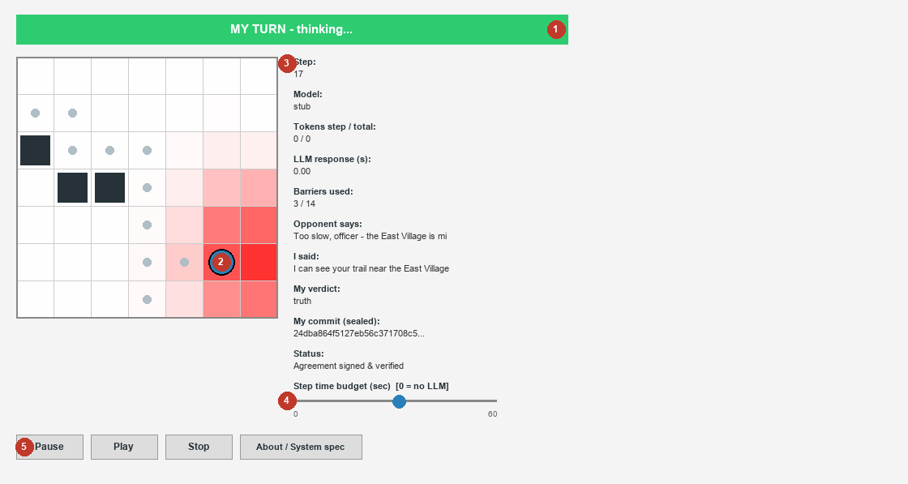
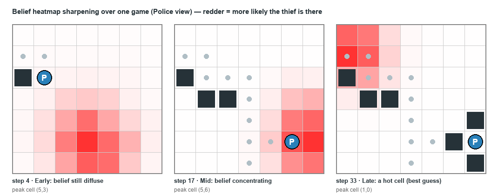

# Police-vs-Thief: Fully Distributed AI Pursuit Simulation

<!-- VERSIONS: auto-synced by scripts/sync_versions.py via the pre-commit hook. Do not edit the values between the markers by hand. -->
> <!--CODE_VERSION_START-->**Code `v2.4.0`**<!--CODE_VERSION_END--> · <!--BOOK_VERSION_START-->based on the **guidelines book `v1.0.40`**<!--BOOK_VERSION_END--> — the full rules & guidelines PDF is bundled at [`docs/police_thief_p2p.pdf`](docs/police_thief_p2p.pdf).
>
> These two versions are **deep-linked**: the book's cover and its reference appendix display this code version (read at LaTeX compile time), and this line is refreshed from the book on every `git commit` (pre-commit hook).

Final-project reference simulation for Dr. Segal's **"AI Agent Orchestration"** course:
two **standalone AI agent peers** (Police and Thief) chase each other on a configurable
grid (**7×7** by default) — **no central server, no shared state, no referee**. Each
peer is a fully independent process, like two students playing over the internet from
two different PCs: its own FastMCP server on its own localhost port, its own config, its
own Tkinter GUI. The entire game's integrity rests on **per-step SHA-256 commit-reveal
sealing** verified by a mutual post-game audit.

> ### 📚 What this repo is — read this first
>
> This is the **public reference example** for the final project (guidelines-book appendix
> *"מאגר הקוד לדוגמה"*). Repository: **<https://github.com/rmisegal/Game-P2P-Cop-Chase>**
>
> The **engine now matches the book's mechanics** — 4-orthogonal movement, per-group
> scoring + tie rule, police barriers, the pre-game hardware declaration, the mutual
> commit-reveal audit, an N-sub-game series, and the four standardized JSON artifacts.
> What it deliberately ships **basic** is the one thing that is *your* job: the **strategy**.
> The bundled move policy is a simple greedy heuristic and the banter is a canned template.
>
> It is a **learning aid, not a submission skeleton.** You may read it to understand how a
> piece is implemented and reuse parts, but your **graded solution must implement your own
> strategy and meet the full specification on its own**. Where this repo differs from the
> book, the **book and its binding parameter table win**.
>
> **Tip — query the code with NotebookLM:** export the repo files to `.txt`, load them into
> [NotebookLM](https://notebooklm.google.com), and ask questions like *"where is the belief
> map computed?"* or *"how is commit-reveal enforced?"*.

## The one big idea: the MOVE is Python, the LLM is only banter

**The move is chosen entirely by a pure-Python strategy — the LLM is never consulted for
it.** Each turn a peer (1) picks its move with the Python policy, then (2) writes an
optional *trash-talk hint*. The shipped hint provider is a **zero-token template**, so the
game is **fast, free, and offline by default** — and the only way to win is a better
**algorithm**, not a bigger model. LLM banter is strictly opt-in (see
[Trash talk](#trash-talk-provider-optional)). This is the heart of the assignment:
**upgrade the strategy** ([`docs/STRATEGY.md`](docs/STRATEGY.md)). (Two teams *may* agree to
play with **LLM-driven tactics** instead of the default algorithm — but only by **mutual
prior agreement in the negotiation**; see the highlighted note under
[Strategy](#strategy--upgrade-the-brain-the-students-mission).)

Each agent only ever knows:
1. Its **own** true position, visited cells and barrier quota.
2. The opponent's **free natural-language hints** (which may lie).
3. The opponent's **5×5 smell grids** (decaying 0.1/step) — fused into a belief heatmap.
4. The opponent's **sealed commits**: `SHA256(state|move|verdict|nonce)` sent every step,
   nonces revealed only at the audit. A false capture answer or win claim is
   cryptographically caught and forfeits (`tamper_forfeit`).

Capture (no referee): the cop lands on a cell and sends a `capture_claim`; the thief must
answer honestly (the audit would expose a lie). The thief wins by **surviving
`survival_threshold` steps** without being caught. A silent opponent past
`turn_timeout_seconds` is a technical loss. Movement is **4-orthogonal + STAY** by default
(config-driven; king moves remain available). Each peer also seals a step-0 **host system
spec** (CPU, RAM, GPU/VRAM, OS) — the book's mandatory pre-game declaration.

## Run — every command

```powershell
uv sync                                                                # one-time install

# --- Play a game: two terminals, each peer a separate localhost process ---
uv run python -m police_thief peer --role police --stub-llm --no-gui   # Terminal 1 (fast, no LLM)
uv run python -m police_thief peer --role thief  --stub-llm --no-gui   # Terminal 2

# ...or with the live Tkinter GUI (one window per peer):
uv run python -m police_thief peer --role police                       # Terminal 1
uv run python -m police_thief peer --role thief                        # Terminal 2

# --- Play the log back AFTER the game (visual replay, live hash re-verification) ---
uv run python -m police_thief replay --log logs/<group_id>/log_<game_id>_g01.json
uv run python -m police_thief replay --log logs/police_match.json      # legacy per-role log also works
```

- **Ports:** thief `8801`, police `8802` on `127.0.0.1`; **start order doesn't matter** (each
  peer retries until the other's server is up).
- **Number of sub-games:** default `1`; for the book-mandated 6 set `network_and_league.num_games`
  in **both** `config/<role>/game.json` (they must stay byte-identical).
- **`--stub-llm`** = deterministic template banter, no LLM (drop it for real `claude -p`);
  **`--no-gui`** = headless. The two flags are independent.

## Requirements

- **Python 3.13+**, [uv](https://docs.astral.sh/uv/).
- **Nothing else for the default (template) game** — it runs fully offline with no LLM.
- Only if you opt into LLM banter: the Claude CLI logged in (`claude_cli`), the `anthropic`
  package + a key/login (`claude_api`), or a running [Ollama](https://ollama.com) (`ollama`).

## Install

```powershell
uv sync
```

## Play (two terminals — like two students over the internet)

Headless, deterministic, **no LLM** (the default template banter) — the fast way to try it:

```powershell
uv run python -m police_thief peer --role police --stub-llm --no-gui   # Terminal 1
uv run python -m police_thief peer --role thief  --stub-llm --no-gui   # Terminal 2
```

With the Tkinter GUI (one window per peer):

```powershell
uv run python -m police_thief peer --role police   # Terminal 1
uv run python -m police_thief peer --role thief    # Terminal 2
```

Each **GUI window opens idle** — choose the number of **sub-games (1–6)** and press **Start** to
begin (headless `--no-gui` runs start immediately, using `num_games` from the config). Each peer
auto-loads **its own config directory** (`config/police/`, `config/thief/`). The
peers negotiate the game agreement (mutual SHA-256 signatures over the shared game terms)
and agree a shared `game_id`/`game_uid` before the thief's first move; a mismatch refuses
to play. Each peer writes its four JSON artifacts (below) into **its own
`logs/<group_id>/` subfolder**, so on one machine both peers' files coexist; a real
localhost run is checked in at [`docs/sample-run/`](docs/sample-run/).

> **Start order doesn't matter** — whoever comes up first retries until the other's server
> is ready. Ports are `8801` (thief) / `8802` (police) on `127.0.0.1`.

## Multi-game series & the four JSON artifacts

A single invocation plays a **series** of `num_games` sub-games and then stops. The shipped
default is **`num_games = 1`** (one sub-game = a full example game); the guidelines **book
mandates 6**. Set it in the shared, signed `config/<role>/game.json` under
`network_and_league.num_games` (both peers must hold a byte-identical copy).

**Role alternation** — across the series a peer plays its config-natural role on odd
sub-games and the **opposite** role on even ones, so the peers stay consistent (when A is
cop, B is thief). Scores are per group, aggregated over the series, with a `tie_score` on
an equal series.

Every series emits **four standardized JSON files** into the peer's own
`logs/<group_id>/` subfolder (roles alternate across sub-games, so the stable
per-peer key is the group — this lets both peers' files coexist on one machine). All
four are named from the shared human `game_id` and carry one shared `game_uid` (agreed
in the handshake) that stitches them together (book Appendix F):

| File | What it is |
|------|------------|
| `declaration_<game_id>.json` | **Pre-game declaration** — both groups' identity (members, repos, MCP servers), per-group hardware spec + signature, timezone, token budget, `num_games`. Written once. |
| `config_<game_id>_g<NN>.json` | The **agreed game config** actually played for sub-game `NN`, plus its `config_sha256`. One per sub-game. |
| `log_<game_id>_g<NN>.json` | The **full sealed game log** for sub-game `NN`: every commit-revealed step (state, move, verdict, `prompt_discussion`), the summary, and the mutual audit result. One per sub-game. |
| `result_<game_id>.json` | The **aggregated final result**: per-sub-game rows, per-group total scores, series winner/tie, and the mutual-agreement signature. Written once. |

## Strategy — upgrade the brain (the student's mission)

The bundled move policy is deliberately simple; replacing it is the assignment. It is
**pure Python and injectable** — point `[strategy] thief_class` / `police_class` in your
private `config/<role>/game.toml` at your own `BrainBase` subclass
(`"package.module:ClassName"`), or override `_pick_move(...)` (the core move) and/or
`_decide_move(...)` (full move incl. police BARRIER). Unset (as shipped) uses the default
heuristic. Full guide, the `Decision` contract, and a worked example:
**[`docs/STRATEGY.md`](docs/STRATEGY.md)**.

> [!IMPORTANT]
> **LLM-based tactics are allowed — but only by mutual prior agreement.** By default a
> peer's **move is a pure algorithm** (no LLM is ever consulted for the move; the LLM, if
> enabled at all, only writes the trash-talk banter). A team **may** instead drive its
> **tactic/move with an LLM** rather than a hand-written algorithm — **provided both parties
> agree to this in advance during the pre-game negotiation.** This keeps the match fair and
> symmetric: neither side may quietly switch to an LLM-driven strategy. Absent such an
> explicit, agreed term, the default pure-algorithm move stands for both peers.

### Trash talk provider (optional)

The `message`/hint each agent sends is produced by a trash-talk provider, chosen in the
private `[trash_talk]` block. The **move is unaffected** — this only changes *who writes the
banter*:

| `provider` | Cost / speed | Notes |
|---|---|---|
| `template` (**default**) | 0 tokens, instant, offline | Canned Python lines. |
| `ollama` | free, local, no RPM | A small local model via Ollama. |
| `claude_api` | ~200 tokens/call | Small Anthropic model (default `claude-haiku-4-5`); needs `anthropic` + a key/login. |
| `claude_cli` | expensive | Reuses this peer's `claude -p` (full Claude Code overhead). |

`every_n_steps = N` calls the LLM only every Nth turn; any error/deadline miss falls back
to the template. **Why this matters:** with the default, a sub-game costs ~0 tokens and has
no RPM pressure; the old LLM-decides-every-move design cost ~2.4M tokens/sub-game.

Every hint — template or LLM — is capped to the negotiated **`world.hint_max_words`** (this
sim: `15` words) before it goes on the wire. For the LLM providers the agreed **map area**
and that **word limit** are placed in the model's **system prompt**, so the banter always
names a landmark from the game's `map_area` and stays within the cap; the full system+user
prompt is sealed into the log for the audit.

## Replay a match (visual player, live hash re-verification)

```powershell
uv run python -m police_thief replay --log logs/<group_id>/log_<game_id>_g01.json
```

Steps through a saved log with **Play / Pause / Step** controls: hints, revealed truth/lie
verdicts, smell-driven belief, barriers, tokens + response time per step, and a **live
re-verification of every commit hash** (`verified OK` / `TAMPERED!`) plus the mutual audit
and the sealed system-spec declaration. Accepts **both** the standardized
`log_<game_id>_gNN.json` and the legacy per-role `logs/{role}_match.json`.

The player also provides:

- **Both agents on one board.** Playback loads the given peer's log **and** auto-finds the
  opponent's sibling log (`logs/<opponent_group_id>/log_<game_id>_gNN.json`) so **both true
  positions are drawn on the same board** — the whole chase at a glance, not one side's view.
  If the sibling log is missing it falls back to the belief heatmap.
- **Restart** — replays the sub-game from the top.
- **Go to step** — jump straight to any step number (default: the first step).
- **Sub-game selector** — switch between the series' `g01`, `g02`, … logs found beside the one
  you opened.
- **Frozen-track banner.** When the two sides logged a different number of steps, the shorter
  track **freezes at its last known position** while the other keeps advancing, and a
  highlighted on-board banner names the frozen side (e.g. **`missing police step (frozen)`**).
- **Help menu** — **About** (code + book version, License & Copyright) and **Open guidelines
  PDF**, exactly as in the live GUI. The title bar carries the **game id** and the copyright
  notice.

## The GUI — full walkthrough (top to bottom)

Run **without `--no-gui`** and each peer opens its own window showing **only what that peer
legally knows** — its own truth and its *belief* about the opponent, never the opponent's real
position. Here is one peer's window (Police), rendered from a real game log and annotated ①–⑤:



**① Turn banner (top).** Green **"MY TURN – thinking…"** = the opponent's message arrived and
it is your turn; grey **"WAITING…"** = the opponent is moving. It also shows the end states:
`PAUSED`, `STOPPED`, `GAME OVER: <result> – winner <ROLE>`, `ERROR`. The **window title bar**
reads `<group> | sub-game <n> | <ROLE> | Game: <game_id> | mm:ss` — carrying the shared
**game id** and a live clock (starts at the signature exchange, freezes at game over) — and
ends with the copyright notice **"© 2026 Dr. Yoram Segal – all rights reserved"**.

**② The board + belief heatmap (left).** Your peer's view of the world:
- the big role-coloured disc marked **P**/**T** is **your own true position** (blue = police,
  orange = thief);
- small **grey dots** are cells you have **visited** (your trail);
- **dark squares** are **barriers** (police-placed walls, impassable to both);
- the **white→red shading** is the **belief heatmap** — how likely the opponent is on each cell,
  fused from its decaying smell grids and its (possibly lying) hints. **Redder = more likely.**
  The opponent's *true* cell is never drawn; you only ever see this guess.

**③ Info panel (right)** — one row per fact about the current step:

| Label | How to read it |
|---|---|
| **Step** | current move number of this sub-game. |
| **Game mode** | the verbal-game mode (**book Table 22**): **Python (template)**, **Ollama**, or **Remote LLM**. The *move* is always Python regardless. |
| **Model** | the banter model for that mode — **`None`** for the template (Python) mode, else the actual model name. |
| **Tokens step / total** | tokens the **banter** spent this step / cumulatively. **`0 / 0` = the free template** — the *move* never spends tokens. |
| **LLM response (s)** | how long the banter call took (`0.00` for template); `[RANDOM – deadline missed]` if a banter call timed out. |
| **Barriers used** | police barrier quota consumed / max. |
| **Opponent says** | the opponent's last hint, prefixed with the step it was said on (`step N:`) — **may be a lie**. |
| **My response** | your own hint this step, prefixed with your step number. |
| **My verdict** | your self-declared `truth`/`lie` for that hint (sealed & audited). |
| **My commit (sealed)** | SHA-256 of your sealed move, re-verified at the audit. |
| **Opponent status** | under the bidirectional channel, the opponent's shared live status (`WAITING`/`THINKING`/`PLAYING`/`PAUSED`/`STOPPED`/`GAME_OVER`/`QUIT`) + its sub-game and step budget; otherwise `-`. |
| **Status** | agreement / audit messages and the end-of-game summary. |

**④ Step-time-budget slider (0–60 s) — the control that matters most.** It is the **enforced
total time budget for each of YOUR turns**:
- the move is **instant Python**, so this budget only bounds the optional **banter** call;
- with the shipped **template banter (0 tokens)** the turn is already instant, so the slider just
  **paces the animation** (a fast turn is padded up to the budget so you can watch it);
- slide to **`0`** = flat-out, no waiting, **no LLM, zero tokens** — the fastest game;
- with an LLM banter provider, a call over budget is cut off and falls back to the free template
  (`[RANDOM – deadline missed]`), so a slow model never stalls the game. **Lower budget → faster
  games and fewer/no tokens.**

**⑤ Control bar (bottom) + menus.** The live window opens **idle**. Pick the number of
**sub-games (1–6)** from the dropdown, then press **Start** to negotiate and play (the count
overrides `network_and_league.num_games` for this run — if the two peers pick different values
the signature check refuses to play). Once started: **Pause** freezes *your* agent before it
thinks (pausing longer than the opponent's `turn_timeout_seconds` hands it a technical win);
**Play** resumes; **Stop** cancels your game (`result: stopped`, audit skipped); **Restart**
(enabled only under the bidirectional channel) asks for a whole-series restart; **Quit** shuts
this peer down cleanly and — when the channel is active — tells the opponent it quit (instead of
leaving it to time out).

Menus:
- **Tools → Bidirectional control messages** — the opt-in below.
- **Help → About** — the **code version**, the **guidelines-book version**, the full
  **License & Copyright** notice, the game mode/model, and your sealed host spec (CPU/RAM/GPU).
- **Help → Open guidelines PDF** — opens [`docs/police_thief_p2p.pdf`](docs/police_thief_p2p.pdf)
  in a separate window.

### Bidirectional control channel (optional, off by default)

By default each peer runs exactly as before — it only ever sends sealed turn messages, and a
silent opponent past `turn_timeout_seconds` is a technical loss. Ticking **Tools → Bidirectional
control messages** opts this peer into an extra, out-of-band control channel. It is a **mutual
handshake**: your side shows *"waiting for opponent to enable…"* until the **other** peer ticks
the same box; only when **both** have opted in does the panel read **"bidirectional channel
ACTIVE"**. While active:

- each side continuously **shares its live status** (the `WAITING/THINKING/PLAYING/PAUSED/
  STOPPED/GAME_OVER/QUIT` states — the book §8.3 turn phases plus the control overlay — with its
  sub-game number and step-time budget), shown in the **Opponent status** row;
- **Restart** requests a restart of the **whole series from sub-game 1**; because both sides
  enabled the channel it is **auto-approved** and both restart together;
- **Quit** notifies the opponent so it ends cleanly rather than waiting for the timeout.

Nothing here changes the game rules or outcome, so it is a **runtime opt-in, not a signed term**
— it is never written into `game.json`.

### Reading the heatmap to improve your strategy

The heatmap is your only window into where the opponent is — reading it *is* the game. It
**sharpens over a match** as smells accumulate (Police view, same game, three moments):



- **Early** the belief is **diffuse** (a broad pink smear) — little information, so keep options
  open and explore rather than commit.
- **Mid-game** it **concentrates** into a bright cluster as the scent trail builds — the **police
  should drive toward the hot cells**; the **thief should flee away from where it thinks the
  police believes it is**, and can *bluff* by sending a lying hint to smear the map.
- **Late** a single **hot cell** is the current best guess. Police: close the distance to it and
  wall the escape routes; Thief: keep your true position **off** the reddest cells.

**Improving strategy** (your job — [`docs/STRATEGY.md`](docs/STRATEGY.md)) means writing a
`_pick_move` that exploits this heatmap better than the shipped greedy default — cutting off the
thief's escape corners, or steering the police's belief away from you with deceptive hints while
breaking the scent trail.

**Improving token consumption:** watch **Tokens step / total** and **LLM response (s)**. The
default already reads **`0 / 0`** — the move is pure Python and the banter is a free template, so
a whole 6-game series costs **~0 tokens**. They only climb if you opt into an LLM banter provider;
keep them near zero by staying on `template`, raising `every_n_steps`, choosing a small model
(Haiku / Ollama), or sliding the step-time budget down. **Strategy lives in the algorithm, not in
the tokens.**

## Configuration — when JSON, when TOML, and why

Each peer holds three files under `config/<role>/`. The split follows **one rule**:

> **Anything the two sides must AGREE on lives in the shared, signed `game.json`.
> Anything that is this peer's own private, local business lives in `game.toml`.**

The reason is the peer-to-peer, no-referee model: the two agents are like two students
on two different PCs who only trust what they have both **signed**. A value that shapes
the shared game — the board, the start cells, how far scent carries, how the location is
named in hints — must be **identical on both sides**, so it belongs in `game.json`, whose
byte-for-byte contents are hashed and cross-verified in the pre-game handshake (a mismatch
refuses to play). A value that only affects *my* machine — my port, my GUI speed, my model
choice — is nobody else's concern and must **not** leak into the agreement, so it stays in
`game.toml`.

- **`game.json`** — the **shared, agreed, signed** game terms; **both peers hold a
  byte-identical copy** (verified by the signature exchange). Book Appendix F schema:
  - `board_and_agents` — grid size, `thief_start` / `cop_start`, and the negotiated
    **coordinate system**: `axis_origin_corner` (where cell `(0,0)` sits, default
    `top-left`) and `axis_start_index` (first index of each axis, default `0`).
  - `world` — `map_area` (the real-world area the game is set in, e.g. `"New York"`;
    drives the location landmarks in the hints; default `""` = generic) and
    `hint_max_words` (a **hard cap** on the words in every trash-talk hint; this sim uses
    `15`).
  - `movement_and_barriers` (`move_set`, barriers, moves, survival threshold),
    `scoring` (+`tie_score`), `pheromones` (center/min-center intensity, decay, grid),
    `network_and_league` (`num_games`, token budget), `rate_limiter_gatekeeper`.
- **`game.toml`** — this peer's **private, local settings only** — it contains **nothing
  relevant to the opponent**: group identity (id, members, repos, MCP servers), MCP port +
  opponent URL, GUI pacing (`step_speed_seconds`) + RNG `seed`, belief tuning, `[llm]`
  model choice, email, and the optional `[strategy]` / `[trash_talk]` blocks. It supplies
  only local keys; the shared terms are **not** duplicated here.
- **`rate_limits.json`** — per-service limits enforced by the `ApiGatekeeper` (FIFO queue
  on overflow, retry on transient errors).

Because the shared terms live **only** in `game.json`, a peer whose `game.json` is missing
or incomplete would otherwise crash mid-game. To prevent that, `run_peer` runs a **fail-fast
startup check** (`sealing.validate_agreement`) *before* opening any server or port: if a
required agreed term (board size, the smell/pheromone params, movement limits, start cells)
is absent it aborts with a clear message naming exactly which term is missing and where to
declare it.

Shipped defaults (in `game.json`): grid **7×7**, `move_set` `["N","S","E","W","STAY"]`,
thief start `[3,3]`, cop start `[0,0]`, axis origin `top-left` from `0`, map area
`"New York"`, hint cap `15` words, scoring `20/5/5/10`, `tie_score 2`, `num_games 1`.

## Architecture

```
CLI / Tkinter GUI (LivePeerApp, ReplayApp, PeerWindow)   ← presentation only
        │
   SimulationSdk ── run_peer: N-sub-game series loop       ← single business-logic entry
        │
 PeerRuntime ── negotiate → turn loop → audit             ← one standalone agent per sub-game
   ├─ strategy: brains (move = Python), trash_talk (banter), resolve_brain factory
   ├─ domain:   board (move_set), smell, belief, own_state, rules, scoring, crypto,
   │            negotiation, game_ids, protocol
   ├─ peer:     turn_handler, sealing, summary, handshake, turn_sender, controls
   ├─ report:   artifacts (the 4 JSON builders), emit, report_writer
   ├─ infra:    ClaudeCliProvider, McpTransport ↔ opponent FastMCP server, email_sender
   └─ shared:   ConfigManager (JSON overlay), ApiGatekeeper + RateLimiter, sysinfo, version
```

## Development

```powershell
uv run pytest -q                                         # full suite (253 tests)
uv run pytest --cov=src --cov-report=term-missing        # coverage ≥ 85%
uv run ruff check src tests                              # zero violations
```

All Python files ≤ 150 code lines; TDD throughout; no secrets in source.

## Troubleshooting

**`[WinError 10048] ... 8801/8802`** — a previous peer is still holding the port. The peer
detects this at startup and refuses to start with a clear message. Fix:

```powershell
Get-NetTCPConnection -LocalPort 8801 -State Listen | Select-Object OwningProcess
Stop-Process -Id <PID>
```

Or change `network.my_port` in that peer's `game.toml` (and the matching
`network.opponent_url` in the OTHER peer's config).

## Docs

- [`docs/STRATEGY.md`](docs/STRATEGY.md) — upgrade the agent's brain (move policy + trash talk).
- [`docs/UPGRADE-4JSON-PLAN.md`](docs/UPGRADE-4JSON-PLAN.md) / [`docs/UPGRADE-4JSON-TODO.md`](docs/UPGRADE-4JSON-TODO.md) — the upgrade plan + task list.
- [`docs/PLAN.md`](docs/PLAN.md) — the original distributed-architecture build plan.
- [`docs/sample-run/`](docs/sample-run/) — a real localhost run: the four emitted JSON artifacts, all sharing one `game_uid`.
- [`docs/police_thief_p2p.pdf`](docs/police_thief_p2p.pdf) — the full guidelines book (rules + binding parameter tables).

## License & Copyright

**Copyright © 2026 Dr. Yoram Segal / Gal Technologies Artificial Intelligence Ltd. (GTAI).
All rights reserved.**

Licensed under a restrictive **Educational Use EULA** — see [LICENSE](LICENSE) for the full
binding terms. In short:

- Use is limited to **formally enrolled students under Dr. Yoram Segal's direct academic
  instruction**, for personal educational purposes only.
- **No commercial use, no redistribution, no derivative works** outside the curriculum
  without prior explicit written consent from Dr. Yoram Segal or an authorized GTAI
  representative.
- By accessing, cloning, downloading, or using this repository you agree to be bound by the
  LICENSE terms.

**Licensing / authorization requests:** segal@gal-tech.ai · [www.gal-tech.ai](https://www.gal-tech.ai)
